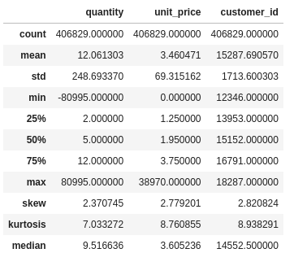
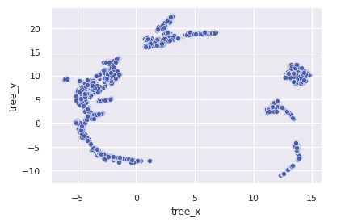
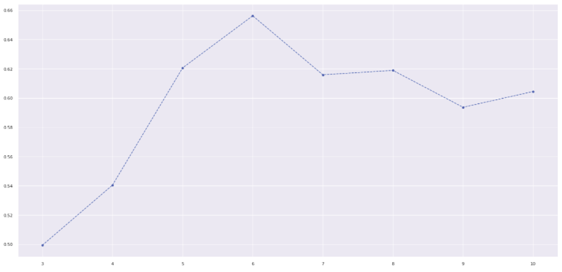
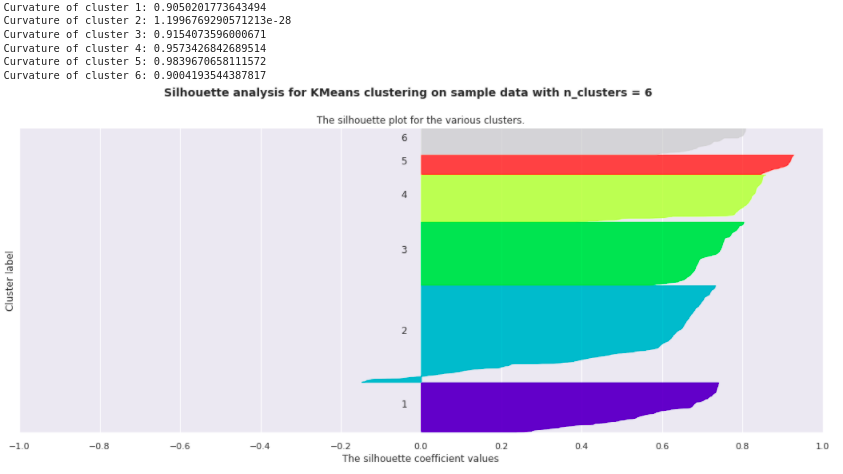
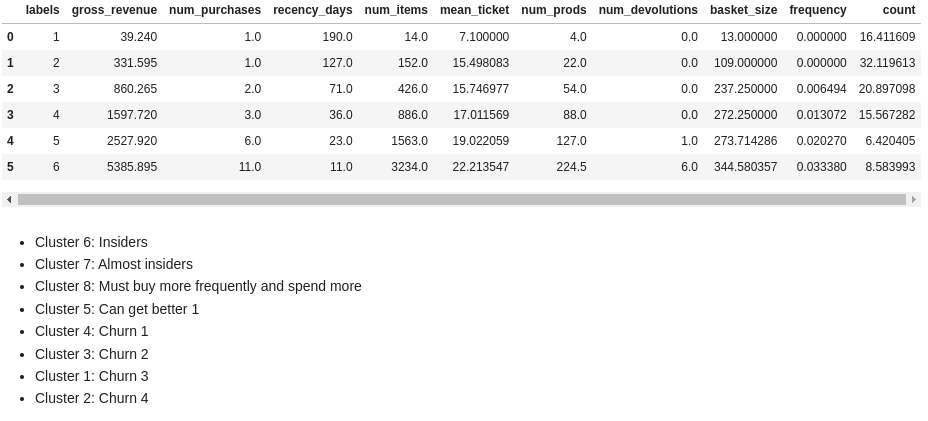
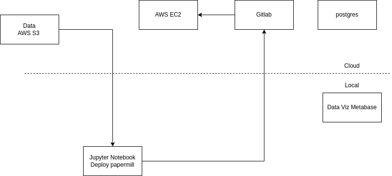
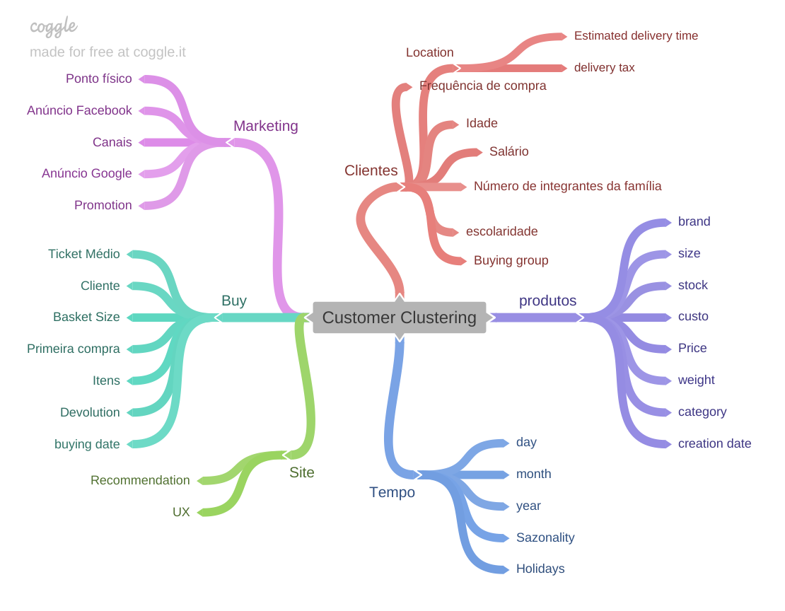

# Insiders cluster

## The (ficticious) enterprise All-in-One need to know which customers are giving more revenue, what are the groups of consume and their indicators. This project aims to clustering clients with purpose of offering fidelity program.

#### This project was made by Daniel Penalva.

# 1. Business Problem.

All-in-One has provided 1 year of registers of trading, of comsuption and devolution of products. The enterprise wants to know what is the groups of consumption in order to better target the customers with offers, cupoms, gifts and to produce a efficient marketing strategy. One of the programs planned is a fidelity program for the most valuable customers, called Insiders, we need to answer the questions:

**1. Who is the Insiders ?**
**2. How many are Insiders ?**
**3. The main characteristic of the insiders.**
**4. Insiders contribution of the total revenue.**
5. Expectance of gross-revenue of Insiders for next months.
6. What are the conditions to be Insiders ?
7. What are the conditions to be removed from Insiders ?
8. What is the warranty of the Insiders group outperforms another groups ?
9. What actions can the market team take ?

I answer the first 4 of these question in this project.

# 2. Business Assumptions.

I assume that the cost of the business is not a target variable. That is, the enterprise is not planning to break even yet and is growing, using investment to deal with the cost of having devolutions, gifts, fees and others.

# 3. Solution Strategy

My strategy to solve this challenge was:

**Step 01. Data Description:**

- Does negative quantities makes sense ?
- Does 0 price makes sense ?

**Step 02. Feature Engineering:**

- Assuming the Recency Frequency Monetary model as baseline i derive these 3 features.
- I derive more features that can serve as indicators to the customer performance such:
  - Number of different products.
  - Number of purchases.
  - Quantity of items.
  - Mean ticket.
  - Gross Revenue.
  - Frequency of buying (total of purchases/time period of buying).

**Step 03. Data Filtering:**

- I divided between products buyed and devolutions(negative quantity).
- Filtered for positive values of price.
- Filtered stock codes that does not make sense for the business assumptions.
- Filtered outliers, values greater than Inter Quantile Range, that represents buying and devolution at the same day.

**Step 04. Exploratory Data Analysis:**

- I use the tool pandas profiling.
- Low Coefficient of Variation, features with low variation in the pairplot for the axis of the other feature are candidates to be filtered out because does not inform well how to cluster the customers.
- We have distributions with a lot of outliers, indicating which scalers to use and to further investigate that feature.

**Step 05. Data Preparation and Embedding Space Exploration:**

- Clustering requires rescaling, i use min max scaler that is according to the view of EDA with outliers.
- Embedding spaces organize data help us get better results in the clustering.
- We test the projection space of PCA, of Uniform Manifold (UMAP) and RandomForest leafs projected with UMAP.
- The third option selected is shown above.

**Step 06. Feature Selection:**

- I select the feature according to the EDA, the features with high CV and significant pair plot distribution.

**Step 07. Machine Learning Modelling:**

- Four clustering algorithms are tested: K-Means, Gaussian Mixture Models, Hierarchical Clustering and DBSCAN.
- Hierarchical Clustering is selected by silhouette analysis, the clusters shows high separability.

**Step 08. Hyperparameter Fine Tunning:**

- To select the number of clusters of the algorithms we plot the silhouette metrics against the number of cluster.
- The higher the metrics more separated and coherent the cluster.

- Curvature metrics near to 1 indicates a concise cluster, near to 0 indicates mis-classified data with negative silhouette.

**Step 09. Convert Model Performance to Business Values:**

- The Insiders group (cluster 6) indicates that 8.6 % of the customer base contributes with 53% of the revenue.

**Step 10. Deploy Model to Production:**

- The model is deployed in a Jupyter Notebook (the case that clustering is evaluated with low frequency, not being necessary to deploy an API with the ETL in a package) in AWS EC2, accessing AWS S3 to get data and pkl scalers and the result is registered in AWS RDS database.

# 4. Top Data Insights

**Insiders has 10% bigger mean ticket, in relation to Almost Insiders ?**
- Insiders mean ticket is 321 % the value of the second group.

**The Insiders group (cluster 6) indicates that 8.6 % of the customer base contributes with 53% of the revenue.**

# 5. Machine Learning Model Applied

- Hierarchical Clustering

# 6. Conclusions

- To have a fidelity group is of high importance since their customer contributes to great part of the revenue of the enterprise. Segmentation of customers in clusters helps to provide strategy to target customers to increase the fidelity group volume.

# 7. Lessons Learned

- Embedding space of trees is a good strategy to organize the data space and well choosen features can help to explain its efficacy.

# 10. Next Steps to Improve

- Statistical test to determine the interval of values of the features where one customer is considered of the fidelity group or not.
- A/B test to comprove the segmentation is doing a good job.

# LICENSE

# All Rights Reserved - Comunidade DS 2022
