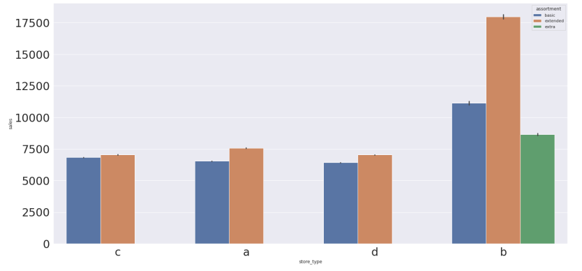
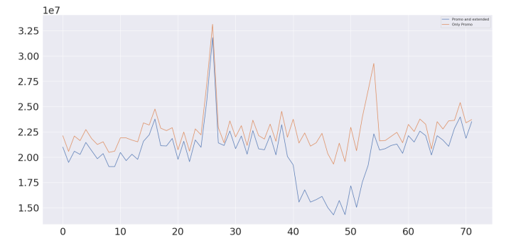

# Rossmann drug retailer 6 weeks sales prediction

Rossmann operates over 3,000 drug stores in 7 European countries. Currently, Rossmann store
managers are tasked with predicting their daily sales for up to six weeks in advance. Store sales are
influenced by many factors, including promotions, competition, school and state holidays, season-
ality, and locality. With thousands of individual managers predicting sales based on their unique
circumstances, the accuracy of results can be quite varied.

# Steps in solving the problem

## Feature Description and Filling-up the missing values

First step is to describe features and deal with missing values. Percentage of missing values in the dataset:

## Feature filtering and engineering 

- I filtered out registers where stores were not open or sales are 0.

## Exploratory Data Analysis

### Sales by type of store

- It's possible to observe that stores with extended assortment sell more, this result is pronounced for store type b.

### Sales by type of holiday

- I observe that we have more sales at easter holiday.

### Sales negatively correlates with distance

- It's possible to observe that sales decrease with competitors distance to the store.

### Sales are lower with extended promotions than with promotions only

## Encoding categorical features and re-scaling features according to EDA.

- I use min max scaler and robust scaler, according to the number of outliers in each feature
- I apply the log scale to the target Sales, so it has a normal distribution.

## Apply feature selection algorithm Boruta to select most relevant features.

## Train Test Split and apply the metrics for baseline models (mean and linear regression)

- I apply the mean absolute error MAE and the mean absolute percentage error MAPE to the predictions of 6 weeks.
- Baseline model mean has a MAPE of 30 % and mean has a mape of 22 %

## Apply Cross Validation to the Random Forest and Gradient Boost Regressors.

## Evaluate the value of the profit for the best case scenario and worst case scenario by store.

- The total profit, summing all stores is:

## Implement ETL in Heroku platform to be accessible by any means such a bot
